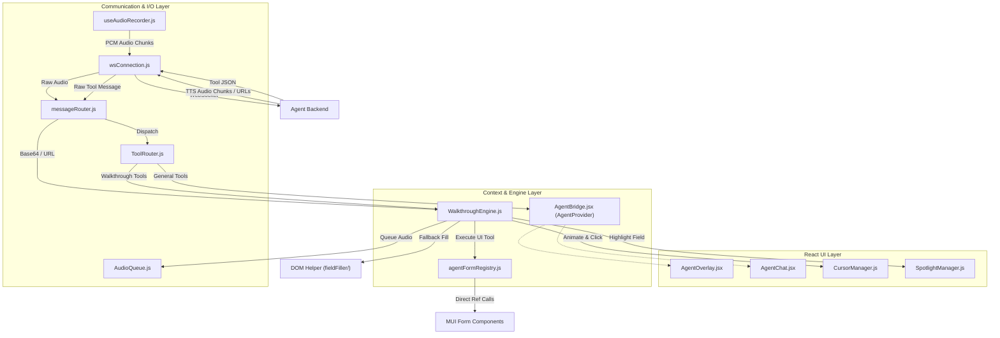
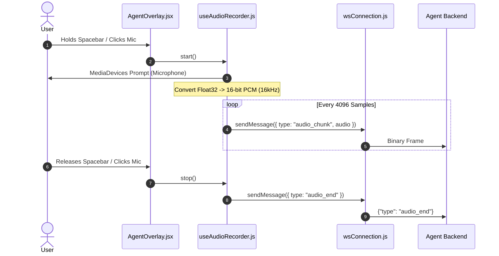
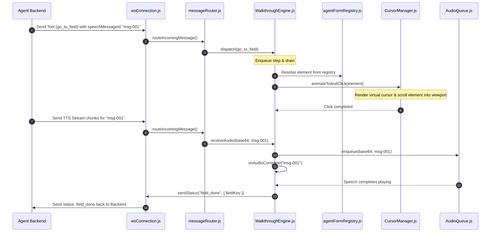
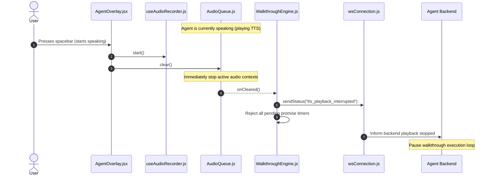

# Agent Frontend — Architecture

The Agent Frontend module manages the user-facing interface, real-time audio capturing, and visual execution of walkthrough events. It bridges the React application context to the agent backend server over a persistent WebSocket connection.

---

## 🧩 Architectural Overview

The frontend agent operates as an event-driven system:



---

## 📂 File Hierarchy

The agent frontend code is fully encapsulated within the [src/agent](file:///Users/akshith/LG/linengrass-laundry-erp/src/agent) directory:

```
src/agent/
│
├── AgentBridge.jsx             React Context Provider binding WS state to React trees.
├── AgentOverlay.jsx            Floating voice controller (Orb/Mic and expanded UI).
├── AgentChat.jsx               Chat history window displaying user transcripts and agent text responses.
├── AgentErrorBoundary.jsx      React Error Boundary for isolating UI errors.
│
├── wsConnection.js             Persistent WebSocket manager with buffer-backed queuing & exponential backoff reconnects.
├── protocol.js                 Shared vocabulary of message types, status events, timings, and tools.
├── messageRouter.js            Parses incoming WebSocket payloads, separating tool executions from audio streams.
├── ToolRouter.js               Routes backend tool calls to WalkthroughEngine or GeneralHandler.
├── GeneralHandler.js           Executes general tools (e.g. respond, navigate, stop_audio).
│
├── WalkthroughEngine.js        State orchestrator managing execution queues, pause/resume, and audio completions.
├── WalkthroughHandler.jsx      React mount wrapper that wires WalkthroughEngine to the AudioQueue and active context.
│
├── AudioQueue.js               Sequenced audio playback manager supporting both base64 chunks (Web Audio API) and URLs (HTML5 Audio).
├── useAudioRecorder.js         Microphone input hook handling MediaDevices, echo cancellation, and PCM conversion.
├── CursorManager.js            Injects and animates a virtual mouse cursor with sound effects for realistic form automation.
├── SpotlightManager.js         Visually highlights (spotlights) the field currently targeted by the agent.
│
├── agentFormRegistry.js        Centralized registry where active forms register programmatic API bindings (setters, searchers, getters).
├── formExecutor.js             Orchestrates programmatic actions (adds, clears, fills) on registered forms.
│
├── fieldFiller/                ── DOM FALLBACK LAYER ──
│   ├── index.js                Unified DOM entry point for non-registered forms.
│   ├── finder.js               Heuristic-based DOM field selector resolving keys to form elements.
│   ├── buttonHelper.js         DOM button clicker & checkbox toggler.
│   ├── dialogHelper.js         DOM dialog closer.
│   ├── fillAutocomplete.js     DOM simulation of Autocomplete selections.
│   ├── fillSelect.js           DOM simulation of Select options.
│   ├── fillText.js             DOM simulation of typing text.
│   ├── fillToggle.js           DOM simulation of Toggle/Switch inputs.
│   └── nativeSetValue.js       React input property descriptor bypasser.
│
└── toolHandlers/               ── TOOL EXECUTIONS ──
    ├── index.js                Imports and registers all tools.
    ├── begin_walkthrough.js    Initializes walkthrough context for a specific form.
    ├── actionTools.js          Executes UI actions (open/close dialog, select row, click element).
    └── fieldTools.js           Executes field-specific actions (go to, fill, explain, count options).
```

---

## 📡 Protocol Specification

The WebSocket communications rely on message schemas defined in [protocol.js](file:///Users/akshith/LG/linengrass-laundry-erp/src/agent/protocol.js).

### 1. Inbound Messages (Backend → Frontend)
The frontend listens for three main message formats:

*   **Tool Executions**:
    ```json
    { "type": "tool", "tool": "go_to_field", "args": { "fieldKey": "hotelId", "label": "Hotel" } }
    ```
*   **TTS Audio Stream**:
    ```json
    { "type": "tts_audio", "audio": "<base64_pcm_chunk>", "messageId": "msg-123", "done": false }
    ```
    ```json
    { "type": "tts_audio", "url": "https://s3.amazonaws.com/...", "messageId": "msg-124" }
    ```
*   **Errors**:
    ```json
    { "type": "error", "message": "Failed to parse intent" }
    ```

### 2. Outbound Messages (Frontend → Backend)
The frontend sends three types of payloads:

*   **Audio Streaming**:
    ```json
    { "type": "audio_chunk", "audio": "<base64_pcm_chunk>" }
    ```
    ```json
    { "type": "audio_end" }
    ```
*   **Events (Status Events)**:
    ```json
    { "type": "event", "name": "field_reached", "fieldKey": "hotelId" }
    ```
*   **Barge-in / Playback Events**:
    ```json
    { "type": "event", "name": "tts_playback_interrupted" }
    ```

---

## 🔄 Interaction Flows

### 1. User Voice Input Flow


### 2. Walkthrough Execution Flow (Sequential Step Coordination)


### 3. Barge-In (Interrupting Playback)


---

## 🛠️ Key Modules Breakdown

### 1. The Context Bridge ([AgentBridge.jsx](file:///Users/akshith/LG/linengrass-laundry-erp/src/agent/AgentBridge.jsx))
This component serves as the global integration boundary:
*   Initializes the WebSocket URI with a persistent `sessionId` stored in `sessionStorage` (so refreshing the page reuses the current agent context).
*   Appends the logged-in username to the connection string to allow personalized agent interactions.
*   Exposes reactive states (`connectionStatus`, `agentMessages`, `isProcessing`, `isAgentSpeaking`, `isWalkthroughActive`) to visual components.

### 2. The Form Registry ([agentFormRegistry.js](file:///Users/akshith/LG/linengrass-laundry-erp/src/agent/agentFormRegistry.js))
Rather than relying solely on fragile DOM element scanning, React form components register themselves with the `AgentFormRegistry` when mounted:
*   Exposes a clean interface:
    ```javascript
    register(formId, {
      fields: [{ key, set, getOptions, getElement }],
      subForms: [{ id, add, fields }],
      clearAll: () => void
    })
    ```
*   Allows the `WalkthroughEngine` to trigger React state updates directly, bypassing complex DOM simulated clicks for inputs like autocompletes, date-pickers, or multi-select dropdowns.

### 3. Fallback Filler ([fieldFiller/index.js](file:///Users/akshith/LG/linengrass-laundry-erp/src/agent/fieldFiller/index.js))
If a form does not support or register with the programmatic registry, the agent dynamically falls back to native DOM simulation:
*   **finder.js**: Utilizes heuristic searches mapping keys/labels to `<input>`, `<select>`, `.MuiInputBase-root`, and button tags.
*   **nativeSetValue.js**: Bypasses React's internal value tracking mechanism by overriding default HTML input property descriptors (triggering native `input` and `change` dispatch events).

### 4. Interactive UX Enhancements
To provide a premium, collaborative experience, the agent visually simulates system interactions:
*   **CursorManager.js**: Renders an absolute SVG cursor. It scrolls elements smoothly into view and moves the cursor with a spring-like CSS transition (`spotlight.css`), playing a mechanical click sound effect upon clicking.
*   **SpotlightManager.js**: Adds a glowing CSS outline (`agent-spotlight`) to elements that the agent is currently talking about or modifying, allowing the user to follow along visually.
